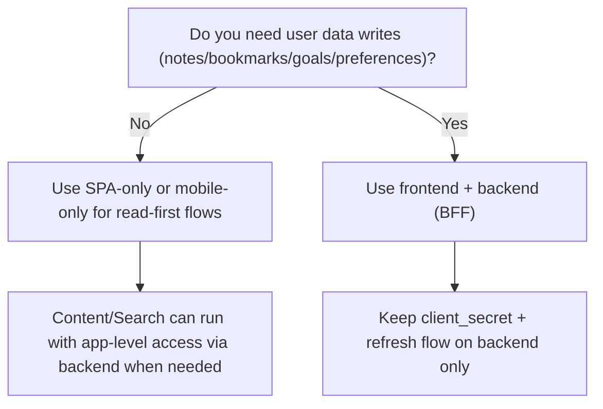

# Tadabbur

**Tadabbur** (تدبر) - *Your Quranic Reflection Companion*

A premium Quran study workspace built with the Quran Foundation SDK, featuring reading, search, reflections, and personal spiritual growth tools.

## About Tadabbur

Tadabbur means "deep reflection and contemplation" in Arabic - the essence of meaningful Quran study. This application provides a comprehensive platform for:

- **Quran Reader** - Read with translations, audio recitation, and beautiful typography
- **Personal Notes & Bookmarks** - Capture insights and mark meaningful verses
- **Collections** - Organize verses by theme or topic
- **Reading Goals** - Track progress and build consistent habits
- **Reflections** - Share and discover community insights (QuranReflect integration)
- **Niyyah Journey** - Set spiritual intentions and track commitments
- **Spiritual Pulse** - Check in with your spiritual state
- **Prayer Times** - Stay connected with daily prayers
- **Daily Verse** - Start each day with Quranic wisdom

## Framework & Architecture

Framework-aware Quran Foundation starter kit using `@quranjs/api`.

This repo currently contains the Next.js App Router template implementation plus
the shared integration contract that additional templates should follow. Keep
framework-specific code inside the template, and keep auth, token, session, and
SDK behavior consistent across templates.

The included `next` template is a single deployable app with:
- OAuth2/OIDC login + logout
- server-side session handling
- Quran reader + content preview
- search
- notes, bookmarks, collections
- goals + preferences payload tools
- QuranReflect profile/feed/posting

## Why this starter exists
- Fast path from zero to an app that can authenticate and call core APIs.
- Documents a small shared contract for Quran Foundation templates.
- Includes a production-friendly frontend + backend boundary (BFF) template.
- Keeps secrets and refresh tokens server-side.

## Template scope
Current template matrix:

| Template | Status | Use when |
| --- | --- | --- |
| `next` | Implemented here | You want a deployable Next.js App Router app with server-side SDK calls. |

Future templates should keep the same SDK semantics:

- content/search use an app-token backend path
- user actions use a user-session backend path
- browser code never receives `CLIENT_SECRET`, refresh tokens, or access tokens
- logout uses the OIDC end-session flow

## Scaffold with `create-app`

Published target command:
```bash
npx @quranjs/create-app@latest my-quran-app
```

The create-app package can expose multiple templates. This repository currently
implements the `next` template:

Current POC local command:
```bash
npx --yes file:/absolute/path/to/quranjs-create-app/packages/create-app my-quran-app --template next --package-manager npm --install --git --sdk-source npm --yes
```

AI-first local SDK mode:
```bash
npx --yes file:/absolute/path/to/quranjs-create-app/packages/create-app my-quran-app --template next --package-manager npm --install --git --sdk-source local --sdk-local-path /absolute/path/to/api-js/packages/api --yes
```

Then:
```bash
cd my-quran-app
npm run dev
```

## Quick start
```bash
npm install
cp .env.example .env.local
```

Set required vars in `.env.local`:
- `PORT` (optional, defaults to `3000`)
- `APP_BASE_URL`
- `CLIENT_ID`
- `CLIENT_SECRET`
- `SESSION_SECRET`

Run:
```bash
npm run dev
```
Open [http://localhost:3000](http://localhost:3000).

## SDK source switching
Remote npm:
```bash
npm run sdk:remote -- latest
```

Local SDK build:
```bash
npm run sdk:local -- /absolute/path/to/api-js/packages/api
```

Show installed SDK:
```bash
npm run sdk:status
```

## Runtime-split requirement
This starter expects runtime-split entrypoints:
- `@quranjs/api/public`
- `@quranjs/api/server`

If your installed package does not export these yet, use:
```bash
npm run sdk:local -- /absolute/path/to/api-js/packages/api
```
or install a published runtime-split version when available.

## Environment contract
See:
- [.env.example](./.env.example)
- [.env.local.example](./.env.local.example)

Defaults:
- Production base URLs are built-in via SDK defaults.
- Local service overrides are optional and env-driven.
- `REDIS_URL` enables shared session store; without it, in-memory store is used.

## Session storage and deployment
- Local/dev: in-memory session store works for single instance.
- Production multi-instance: use `REDIS_URL` (or another shared store).
- Browser stores only signed session cookie, not raw tokens.

## Two token paths (important)
- User token path:
  - from OAuth2 code exchange
  - used for notes/bookmarks/collections/goals/reflections
- App token path:
  - server SDK uses `client_credentials`
  - used for content + search

This is why content/search can keep working while a user session expires.

## 3 app shapes cheat sheet
1. SPA only (browser-only):
   - good for public data and lightweight experiences
   - cannot safely hold `client_secret`
   - not suitable for confidential user-token flows by itself
2. Mobile only:
   - can do PKCE-based user login
   - still should avoid embedding confidential secrets in app binaries
   - often pairs with backend for richer confidential flows
3. Frontend + backend (recommended):
   - frontend handles UX
   - backend handles code exchange, refresh, session, and app-token calls
   - supports both user features and content/search cleanly

Decision flow:


## Routes
UI:
- `/`
- `/read/[chapterId]`
- `/search`
- `/library`
- `/goals`
- `/reflect`
- `/settings`

Auth + data:
- `/api/auth/start`
- `/callback`
- `/api/auth/logout`
- `/api/bootstrap`
- `/api/search`
- `/api/reader/[chapterId]`
- mutations under `/api/notes`, `/api/bookmarks`, `/api/collections`, `/api/goals`, `/api/preferences`, `/api/reflections`

## Architecture
See [docs/architecture.md](./docs/architecture.md).

## AI-first docs
- [AGENTS.md](./AGENTS.md)
- [START_HERE.md](./START_HERE.md)
- [docs/recipes](./docs/recipes)

## Verification
```bash
npm run lint
npm run build
npm test
npm run smoke:config
npm run smoke:routes
```
